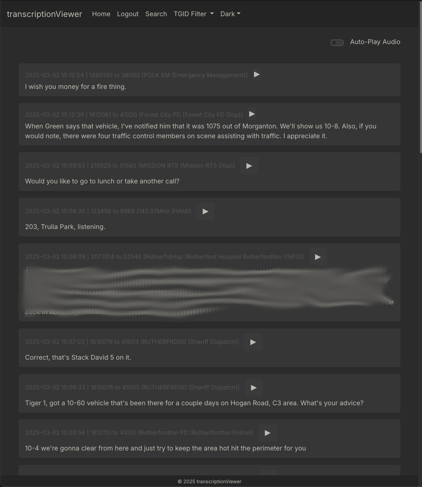
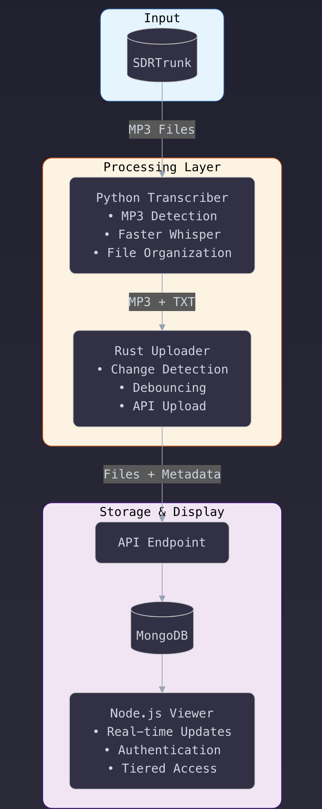
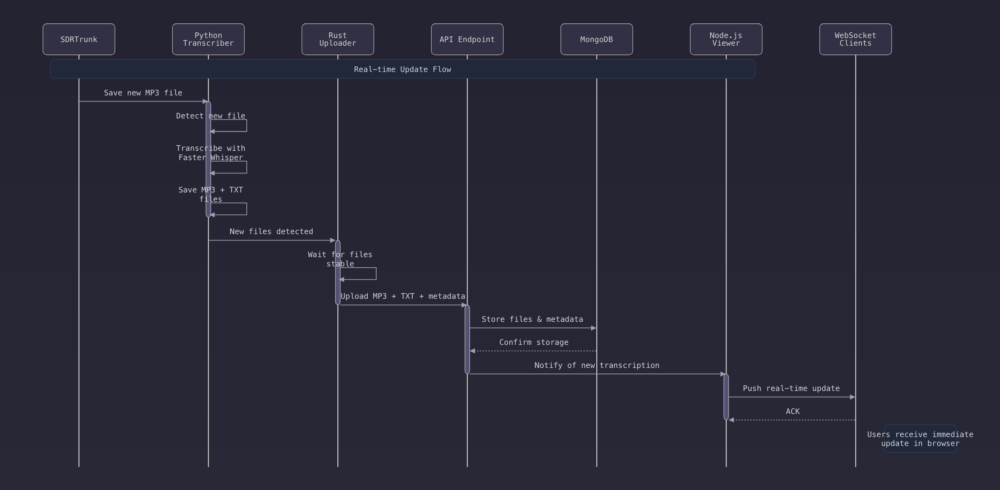

# SDRTrunk Transcription Suite

Welcome to the **SDRTrunk Transcription Suite**, a collection of integrated tools for automatically **transcribing**, **uploading**, and **viewing** radio traffic captured by SDRTrunk. This suite is designed to streamline workflows for anyone using [sdrtrunk](https://github.com/DSheirer/sdrtrunk), by handling audio file transcription, transcription uploads to a remote API, and an interactive web interface to view and analyze those transcriptions in real time.



---

## Overview

This repository combines three major components:

1. **SDRTrunk Transcriber (Python)**  
   - Monitors a directory for new `.mp3` files, automatically transcribes them using [Faster Whisper](https://github.com/SYSTRAN/faster-whisper), and organizes the results.

2. **Transcription Uploader (Rust)**  
   - Watches the transcribed `.mp3` files (and their companion `.txt` transcripts) for changes and uploads them to a remote API endpoint.

3. **Transcription Viewer (Node.js + Express + MongoDB)**  
   - Displays all stored transcriptions in real time, supports user authentication, tier-based features (pagination, advanced search, AI analysis), and a customizable theming system.

Although each component can function independently, they are designed to work together in a pipeline:





---

## Table of Contents

1. [Key Features](#key-features)
2. [Repository Structure](#repository-structure)
3. [Installation & Setup](#installation--setup)
   - [Prerequisites](#prerequisites)
   - [1. SDRTrunk Transcriber](#1-sdrtrunk-transcriber)
   - [2. Transcription Uploader](#2-transcription-uploader)
   - [3. Transcription Viewer](#3-transcription-viewer)
4. [How It All Fits Together](#how-it-all-fits-together)
5. [Running All Components](#running-all-components)
6. [Systemd Services](#systemd-services)
7. [Troubleshooting](#troubleshooting)
8. [Contributing](#contributing)

---

## Key Features

- **Automated Transcription**  
  - Detects new `.mp3` recordings from SDRTrunk and transcribes them via [Faster Whisper](https://github.com/SYSTRAN/faster-whisper).
- **Flexible Architecture**  
  - Each piece (Transcriber, Uploader, Viewer) can run standalone or as a unified pipeline.
- **Scalable Uploader**  
  - Rust-based service that monitors for new/changed files and sends them to a remote API.
- **Modern Web Interface**  
  - Node.js/Express web app for real-time streaming of new transcriptions, searching, AI-based analysis, and theming.
- **AI Integration**  
  - Optional LLM (AI) analysis of past transcriptions using OpenAI or Google AI models.
- **Comprehensive Logging & Error Handling**  
  - All components include robust logging, as well as optional systemd service setups for reliability.

---

## Repository Structure

```
sdrTrunkTranscription
├── transcriber
│   ├── transcriber.py
│   └── README.md    (#1)
├── transcription_uploader
│   ├── src/main.rs
│   ├── Cargo.toml
│   └── README.md    (#2)
└── transcription_viewer
    ├── app.js / index.js (entry point)
    ├── routes/...
    ├── views/...
    └── README.md    (#3)
```

- **`transcriber/`**: Python script + environment for the SDRTrunk Transcriber.  
- **`transcription_uploader/`**: Rust application for detecting/transferring transcriptions.  
- **`transcription_viewer/`**: Node.js/Express application for viewing and managing transcriptions.

Each subdirectory includes a dedicated README covering details specific to that component.

---

## Installation & Setup

Below is a high-level guide on installing and configuring **all three** components. For more detailed instructions, consult each subproject's README (linked within each section).

### Prerequisites

1. **System Requirements**  
   - A Linux server or workstation is recommended, though Windows and macOS can also work with adjustments.  
   - Sufficient disk space and RAM for audio files, transcriptions, and logs.
2. **[ffmpeg](https://ffmpeg.org/)** installed (for the Transcriber).
3. **[faster-whisper](https://github.com/SYSTRAN/faster-whisper)** installed (for the Transcriber); ensure to install its **[requirements](https://github.com/SYSTRAN/faster-whisper#requirements)**.
4. **Python 3.8+**, **Rust 1.64+**, **Node.js 16+**:
   - Python for the Transcriber
   - Rust for the Uploader
   - Node.js for the Viewer
5. **MongoDB** (if running the Transcription Viewer with a local or remote DB).

---

### 1. SDRTrunk Transcriber

**Location**: `transcriber/`

**Primary Script**: `transcriber.py`

**Summary**  
- Watches a root directory (e.g., `/path/to/SDRTrunk/recordings`) for new `.mp3` files.
- Transcribes them using [Faster Whisper](https://github.com/SYSTRAN/faster-whisper).
- Saves the `.txt` transcription alongside the `.mp3`, organized by talkgroup subfolders.
- Moves files below a threshold duration (e.g., 1.5s) to a "tooShortOrError" folder.

**Key Steps**  
1. **Install Dependencies**:  
   ```bash
   pip install faster-whisper watchdog mutagen
   sudo dnf install ffmpeg   # Example for Fedora
   ```
2. **Configure** `transcriber.py` by editing the `Config` class and constants:
   - `ROOT_DIRECTORY`, `TOO_SHORT_DIRECTORY`
   - `MODEL_SIZE`, concurrency settings, GPU/CPU mode, etc.
3. **Run**:  
   ```bash
   python transcriber.py
   ```
4. See [**transcriber/README.md**](transcriber/README.md) for detailed usage, systemd service setup, and troubleshooting.

---

### 2. Transcription Uploader

**Location**: `transcription_uploader/`

**Primary Binary**: `transcription_uploader` (compiled from Rust)

**Summary**  
- Continuously monitors the same directory (or a subdirectory) that the Transcriber writes to.  
- Debounces file changes to ensure `.mp3` and `.txt` files are fully written before upload.  
- Uploads the pair of files to a configured API endpoint along with metadata (talkgroup ID, etc.).

**Key Steps**  
1. **Install Rust** (1.64+ recommended).
2. **Build**:
   ```bash
   cd transcription_uploader
   cargo build --release
   ```
   The compiled binary will be in `target/release/transcription_uploader`.
3. **Configure** environment variables:
   - `MONITORED_DIRECTORY`: Where `.mp3` + `.txt` files appear (often the same directory or subdirectory the Transcriber outputs to).  
   - `API_URL`: Endpoint that will handle file uploads.  
   - `API_KEY`: The key or token for authentication.
4. **Run**:
   ```bash
   ./target/release/transcription_uploader
   ```
5. See [**transcription_uploader/README.md**](transcription_uploader/README.md) for details on environment variables, usage, systemd, and more.

---

### 3. Transcription Viewer

**Location**: `transcription_viewer/`

**Primary Entry**: `server.js`

**Summary**  
- Node.js/Express app that receives your `.mp3` and `.txt` data via an API route (secured with `X-API-Key`).  
- Stores data in MongoDB.  
- Offers a web interface for real-time transcription updates, talkgroup filtering, AI analysis, theming, and admin controls.

**Key Steps**  
1. **Install Node.js** (16+ recommended).
2. **Install Dependencies**:
   ```bash
   cd transcription_viewer
   npm install
   ```
3. **Configure** a `.env` file:
   ```bash
   DATABASE_URL=mongodb://127.0.0.1/transcriptionViewer
   SESSION_SECRET=supersecret
   API_KEY=your_upload_api_key
   WEBSITE_URL=http://yourdomain.com
   # For optional AI usage
   OPENAI_API_KEY=your_openai_key
   ```
4. **Run** (choose one option):
   ```bash
   # Option 1: Direct Node.js execution
   npm start
   ```
   
   ```bash
   # Option 2: Using PM2 for process management
   # First install PM2 globally if you haven't:
   npm install -g pm2
   
   # Start the application with PM2
   pm2 start --name "transcription-viewer" server.js
   
   # Some useful PM2 commands:
   pm2 status                  # Check status
   pm2 logs transcription-viewer   # View logs
   pm2 restart transcription-viewer # Restart app
   pm2 save                    # Save process list
   pm2 startup                 # Generate startup script
   ```
   By default, it listens on port `3000` (configurable).

5. For in-depth setup instructions (HTTPS, advanced caching, theming, etc.), see [**transcription_viewer/README.md**](transcription_viewer/README.md).

---

## How It All Fits Together

1. **SDRTrunk** (or an equivalent SDR recorder) saves `.mp3` files to a known directory.  
2. **SDRTrunk Transcriber** sees these new `.mp3`s, transcribes them, and writes `.txt` transcript files in the same directory (or a subfolder).  
3. **Transcription Uploader** (Rust) detects new/modified `.mp3` & `.txt` pairs. Once stable, it uploads them to the **Transcription Viewer**'s API endpoint.  
4. **Transcription Viewer** inserts the data into MongoDB, caches it, and immediately pushes real-time updates via WebSockets to connected browser clients.  
5. Optionally, user logins (with different tiers) can manage advanced features (LLM analysis, pagination, etc.).

---

## Running All Components

Below is a minimal example of running everything on a single machine. (Adjust paths and environment variables as needed.)

1. **MongoDB** (for Transcription Viewer):
   ```bash
   sudo systemctl start mongod
   ```
2. **Transcriber** (in a dedicated shell/terminal):
   ```bash
   cd /path/to/sdrTrunkTranscription/transcriber
   python transcriber.py
   ```
3. **Transcription Uploader** (in another shell):
   ```bash
   cd /path/to/sdrTrunkTranscription/transcription_uploader
   # Ensure .env or environment variables are set
   cargo run --release
   ```
4. **Transcription Viewer** (in another shell):
   ```bash
   cd /path/to/sdrTrunkTranscription/transcription_viewer
   npm start
   ```
5. **Validate** by placing `.mp3` files in the monitored directory. Check logs for successful transcription and uploads. Then open the Viewer in your browser (e.g., `http://localhost:3000`) to see new entries.

---

## Systemd Services

All three components can be run as systemd services for automatic startup and reliability on Linux systems. Each subproject's README provides example `.service` files. For instance:

- **SDRTrunk Transcriber**: `sdrtrunk-transcriber.service`
- **Transcription Uploader**: `transcription_uploader.service`
- **Transcription Viewer**: `transcription_viewer.service`

General steps:

1. Copy or create a service file (e.g., `/etc/systemd/system/sdrtrunk-transcriber.service`).  
2. Adjust `ExecStart` and environment variables as needed.  
3. Run:
   ```bash
   sudo systemctl daemon-reload
   sudo systemctl enable sdrtrunk-transcriber.service
   sudo systemctl start sdrtrunk-transcriber.service
   # ... similarly for the other components.
   ```
4. Verify via `sudo systemctl status <service-name>.service` and logs via `journalctl -u <service-name>.service -f`.

---

## Troubleshooting

- **Transcriber** 
  - Ensure `ffmpeg` is installed and the correct paths are set in `transcriber.py`.
  - If using GPU, confirm `nvidia-smi` shows your device.
  - Increase verbosity/logging to pinpoint issues in `sdrtrunk_transcription.log`.

- **Uploader**
  - Double-check environment variables (`MONITORED_DIRECTORY`, `API_URL`, `API_KEY`).
  - Confirm file paths are correct and the `.mp3` + `.txt` pairs are actually generated.
  - Look at the console output or logs for upload errors.

- **Viewer**
  - Make sure MongoDB is running and credentials (`DATABASE_URL`) are correct.
  - If `.env` is not recognized, set environment vars manually or specify `EnvironmentFile` in your systemd unit.
  - Check WebSocket connectivity if real-time updates are not working.

---

## Contributing

Contributions are welcome! If you'd like to report a bug, request a feature, or submit a pull request:

1. **Fork** this repository.
2. **Create a new branch** for your feature/fix.
3. **Commit and push** your changes.
4. **Submit a Pull Request** describing the change.

Please see each subproject's README for more specific contribution guidelines and coding styles.

---

### Thank You!

We hope this **SDRTrunk Transcription Suite** helps you efficiently manage, transcribe, upload, and view your SDRTrunk `.mp3` recordings. For detailed usage and custom configurations, refer to each subfolder's README. If you have ideas for improvement or additional features, feel free to open an issue or share your thoughts!

Enjoy your fully automated transcription pipeline!